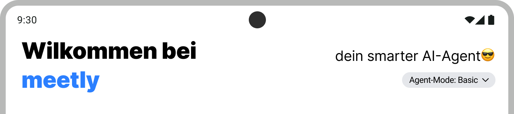
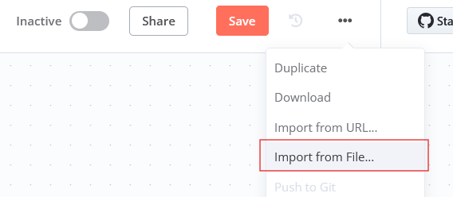

# Meetly
Meetly is an intelligent, gamified meeting assistant that transforms how you manage and engage with your calendar. Using AI-powered voice and text input, Meetly automatically extracts meeting details, provides smart reminders, and rewards you for completing events through an engaging gamification system.

### Key Features:
- 🎤 **Voice & Text Input**: Add events naturally through speech or text
- 🤖 **AI-Powered Extraction**: Automatic date and title extraction using LLM
- 🎮 **Gamification System**: Earn coins for completing meetings and events
- 👥 **Social Features**: Friend quests, shared challenges, and social rewards
- 📱 **Smart Notifications**: Daily reminders and event notifications
- 🏪 **Shop**: Spend earned coins on items

### Platforms:
- 📱 Android
- 🌐 Web Browser

### Gamification Elements:
| Element | Status
|---------|--------
| **Currency** | ✅
| **Quests** | ✅
| **Badges** | ✅
| **Notifications** | ✅
| **Shop** | ✅

## Architecture
**Tech Stack:**
- **Frontend**: SvelteKit + Tauri + TypeScript + Tailwind CSS
- **Backend**: n8n (workflow automation) + Supabase (database/auth)
- **AI Services**: OpenAI Whisper (transcription) + Google Gemini (summarization)

Our [presentation](./Meetly.pdf) on Meetly provides further information on the architecture and the gamification elements that have been implemented.

# Setup
The application uses Sveltekit and follows the standard Sveltekit project structure. The main entry point is `src/routes/+page.svelte`, and the main layout is in `src/routes/+layout.svelte`. Please refer to the [SvelteKit documentation](https://kit.svelte.dev/docs/introduction) for more information on how to work with SvelteKit.

## Prerequisites
- [Node.js](https://nodejs.org/en/download/) (LTS version)
- [Docker](https://docs.docker.com/get-docker/) (for n8n)

## n8n selfhosted Docker Setup
1. Setup and run n8n in a Docker container:
    ```shell
    docker volume create n8n_data
    docker run -it --rm --name n8n -p 5678:5678 -v n8n_data:/home/node/.n8n docker.n8n.io/n8nio/n8n
    ```
2. After accessing the [n8n UI](http://localhost:5678), you need to set up a local account.
3. Create a new workflow and import the [meetly workflow](./meetly-n8n.json) file.
    
4. Set up the credentials for the "OpenAI Whisper" and "Google Gemini Chat Model" Nodes in the workflow:
   - The keys can be found in the .env file [.env file](./.env) as KEY_OPENAI and KEY_GEMINI
5. Activate the workflow by clicking on the "Activate" switch in the top right corner of the n8n UI.

## Webview
### Install dependencies
```shell
npm install
```

### Run the app
```shell
npm run dev
```
When the app is up and running, the Webview can be accessed [here](http://localhost:1420).

## Tauri Android
For Android, a presigned APK is available for quick testing ([meetly-signed.apk](meetly-signed.apk)). However, if you prefer to build and sign your own APK, please follow the detailed instructions below.

### Prerequisites
Please install all the necessary [Tauri prerequisites](https://v2.tauri.app/start/prerequisites/) to set up Tauri and configure the [Android SDK](https://v2.tauri.app/start/prerequisites/#android) as described in the Tauri documentation. 

### Start a Android-Emulator in development mode
```shell
npm run tauri android dev
```

### Build for Android
```shell
npm run tauri android build
```
After building, you can find the APK in the `\src-tauri\gen\android\app\build\outputs\apk\universal\release\` directory.

Before installing the APK on your Android device, make sure to enable "Install from unknown sources" in the device settings and sign the APK with your own keystore (follow [this guide](https://randombits.dev/articles/android/signing-with-cmd)).

## Known Issues
- Notifications for events not yet working
